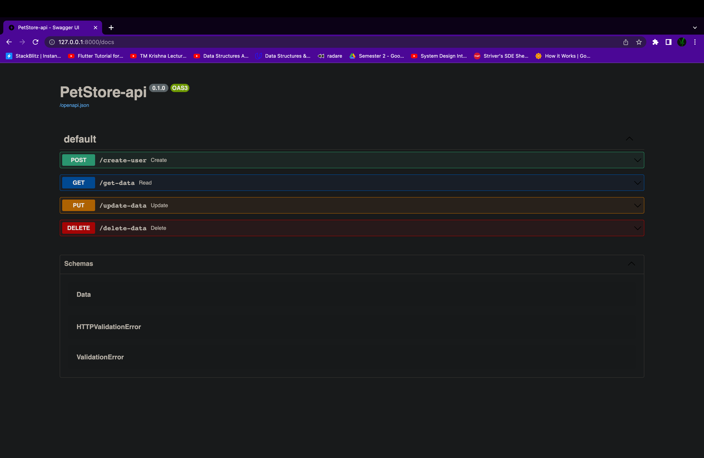
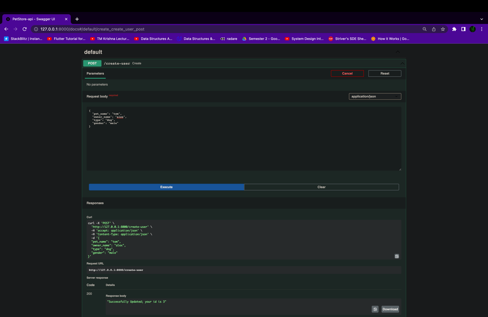
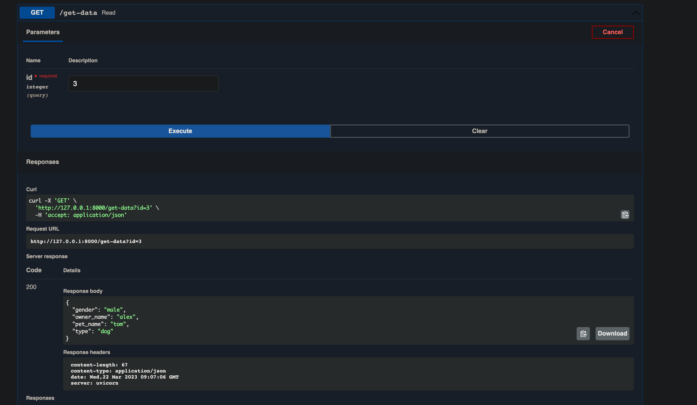
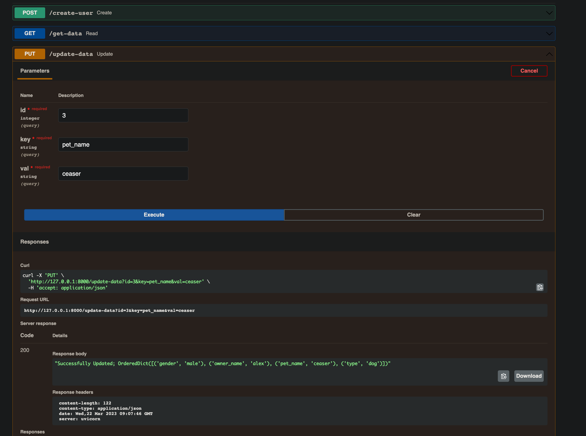
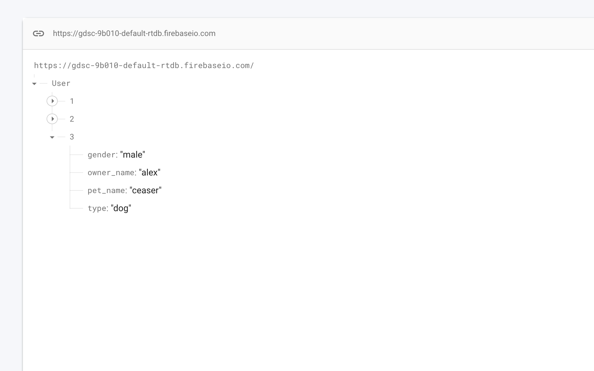
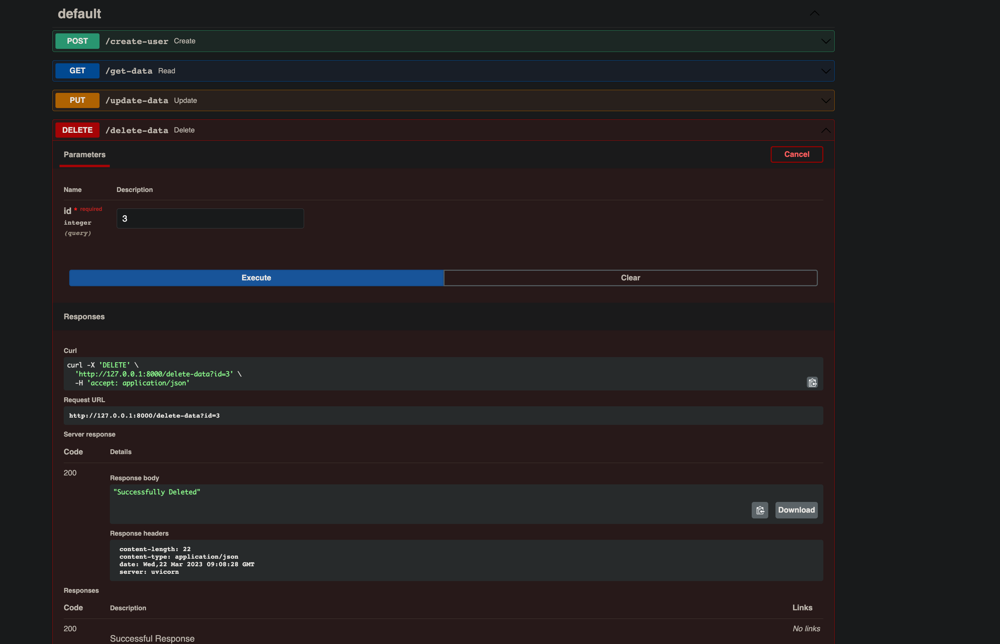

# Pet-Store-API

Performing CRUD operation with integration of FASTapi and Firebase.

# GDSC Tasks

## Backend

- [Pet Store API](https://github.com/vinay-04/Pet-Store-API)
- [Store My Files](https://github.com/vinay-04/StoreMyFiles)

## APP

- [SpaceTonic](https://github.com/vinay-04/bmicalculator)
- [Neom](https://github.com/vinay-04/Neom)
